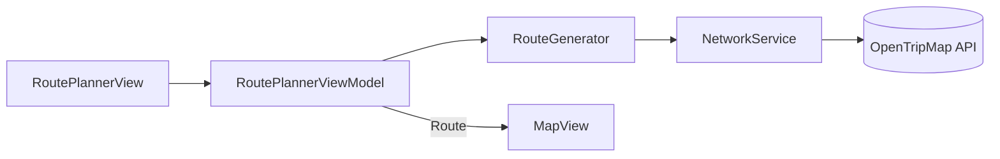

# NatureRoute AI 🌿

A native iOS app that builds multi-day nature trips. Pick a city, trip length and the kind of nature you like, and get a day-by-day route of real places (peaks, forests, lakes, waterfalls, national parks) on an interactive map.

> **Status:** MVP in active development. Route generation is currently data-driven (OpenTripMap). An LLM-powered suggestion layer is planned for a later version.

## Screenshots

| Home | Route planner | Map |
| :---: | :---: | :---: |
|  |  |  |

## Features

- Choose nature preferences: Mountains, Forest, Lakes, Waterfalls, National Parks
- Set city, number of days and places per day
- Generate a route from real OpenTripMap data: places within 50 km of the city, one preference per day, cycling through your choices
- Interactive map with color-coded markers and polylines for each day; the camera fits the whole route
- Save routes on the device with SwiftData and reopen them later
- Loading state and user-facing error messages (for example, city not found or network problems)

## Tech Stack

| Area | Technology |
| --- | --- |
| Language | Swift |
| UI | SwiftUI |
| Architecture | MVVM (`ObservableObject`, `@Published`, `@MainActor`) |
| Concurrency | async/await, `Task` |
| Networking | `URLSession`, `Decodable` / `JSONDecoder` |
| Maps | MapKit, CoreLocation (coordinates) |
| Persistence | SwiftData |
| Data source | [OpenTripMap API](https://opentripmap.io/product) |

## Architecture



- **View** shows state and sends user actions. It contains no business logic.
- **ViewModel** holds screen state, validates input (`canGenerate`) and runs the async work in a `Task`. `@MainActor` guarantees UI state is updated on the main thread.
- **RouteGenerator** turns preferences into OpenTripMap categories and assembles a `Route` from days and places.
- **NetworkService** talks to the API: it resolves a city to coordinates, then fetches places around them.

## Project Structure

```
NatureRouteAI/
├── Models/        Place, Route, RouteDay, NaturePreference
├── Services/      NetworkService, RouteGenerator
├── Features/
│   ├── Home/          HomeView, HomeButton
│   ├── RoutePlanner/  RoutePlannerView, RoutePlannerViewModel
│   └── Map/           MapView
└── NatureRouteAIApp.swift
```

## Roadmap

- [ ] Real road routing with `MKDirections` instead of straight lines between points
- [ ] Transport modes: walking, cycling, car, transit
- [ ] `DirectionsService` and a loading state while routes are calculated
- [ ] Unit tests (XCTest) with a mocked network layer via dependency injection
- [ ] LLM-powered route suggestions
- [ ] Backend and user-generated places

## About

Built by Mykola Sudak, an iOS developer based in the Netherlands. This project is part of my path from factory worker to iOS developer.


